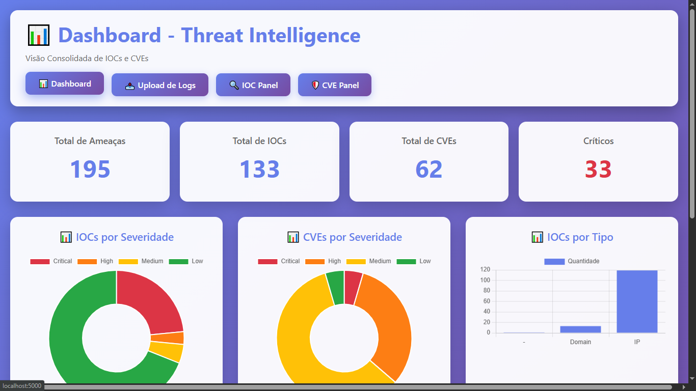
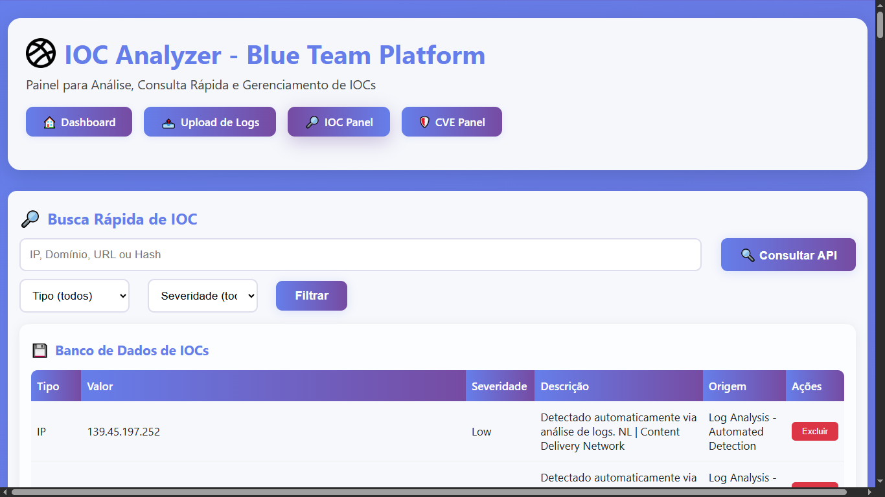
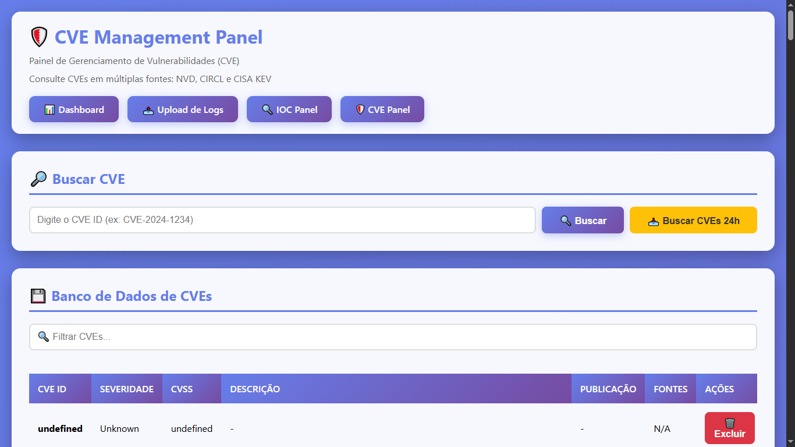

# 🛡️ IOC Analyzer

**Plataforma Blue Team para Análise de Indicadores de Comprometimento e CVEs**


---

## 📑 Índice

- [Sobre o Projeto](#-sobre-o-projeto)
- [Funcionalidades](#-funcionalidades)
- [Estrutura do Projeto](#-estrutura-do-projeto)
- [Instalação](#-instalação)
- [Configuração](#️-configuração)
- [Como Usar](#-como-usar)
- [APIs Integradas](#-apis-integradas)
- [Screenshots](#-screenshots)
- [Roadmap](#️-roadmap)
- [Como Contribuir](#-como-contribuir)
- [Licença](#-licença)

---

## 📖 Sobre o Projeto

O **IOC Analyzer** é uma plataforma desenvolvida para equipes de Blue Team e profissionais de Cibersegurança em geral que precisam gerenciar, analisar e correlacionar Indicadores de Comprometimento (IoCs) e Vulnerabilidades (CVEs) de forma eficiente.

> ✅ **Versão 2.1 - Estável e Pronta para Produção**  
> Esta versão inclui todas as funcionalidades essenciais consolidadas, interface visual aprimorada e integrações de API testadas.

### 🎯 Principais Objetivos

- **Centralização**: Gerenciar IoCs e CVEs em um único local
- **Automação**: Buscar e enriquecer dados de múltiplas fontes
- **Visualização**: Dashboard interativo com gráficos e estatísticas
- **Correlação**: Relacionar IoCs com CVEs conhecidas
- **Análise Forense**: Suporte a investigações e perícia digital

---

## ✨ Funcionalidades

### 📊 Dashboard Interativo
- 6 gráficos dinâmicos
- Estatísticas em tempo real após consulta
- Porcentagens automáticas
- Visão geral do ambiente

### 🔍 IOC Panel
- Painel completo de IoCs
- Busca visual na página
- Suporte: IPs, URLs, Hashes, Domínios
- Classificação por tipo e severidade

### 🛡️ CVE Panel
- Gerenciamento de CVEs
- Integração NVD API
- Severidade (CVSS v3.1)
- Tradução automática para português

### 🔗 Integrações API
- **VirusTotal**: Análise de URLs, domínios, IPs e hashes
- **AbuseIPDB**: Reputação de endereços IP
- **CISA KEV**: CVEs ativamente exploradas
- **CIRCL CVE**: Base alternativa de CVEs
- **NVD (NIST)**: Base nacional de vulnerabilidades

### 🎨 Interface Moderna
- Tema escuro profissional
- Responsivo (mobile-first)
- Cards visuais organizados
- Navegação intuitiva

### 💾 Persistência de Dados
- JSON Database
- Export/Import
- Backup automático
- Histórico completo

---

## 📁 Estrutura do Projeto

```
ioc_analyzer/
├── data/
│   ├── ioc_database.json      # Base de IoCs
│   └── cve_database.json      # Base de CVEs
├── docs/
│   ├── img/                   # Screenshots
│   └── DOCUMENTACAO.html      # Documentação interativa
├── ioc/
│   ├── abuseipdb_client.py    # Cliente AbuseIPDB
│   ├── virustotal_client.py   # Cliente VirusTotal
│   ├── cisa_kev_client.py     # Cliente CISA KEV
│   ├── circl_cve_client.py    # Cliente CIRCL CVE
│   ├── nvd_cve_client.py      # Cliente NVD ✅
│   └── url_checker.py         # Verificador de URLs
├── parsers/
│   └── log_parser.py          # Parser de logs
├── templates/
│   ├── dashboard.html         # Dashboard principal
│   ├── ioc_panel.html         # Painel de IoCs
│   └── cve_panel.html         # Painel de CVEs
├── webapp.py                  # Aplicação Flask
├── requirements.txt           # Dependências Python
├── .env                       # Variáveis de ambiente
├── .gitignore
└── README.md
```

---

## 🚀 Instalação

### Pré-requisitos

- Python 3.8 ou superior
- pip (gerenciador de pacotes Python)
- Git

### Passo 1: Clonar o Repositório

```bash
git clone https://github.com/SEU_USUARIO/ioc_analyzer.git
cd ioc_analyzer
```

### Passo 2: Criar Ambiente Virtual (Recomendado)

```bash
# Linux/Mac
python3 -m venv venv
source venv/bin/activate

# Windows
python -m venv venv
venv\Scripts\activate
```

### Passo 3: Instalar Dependências

```bash
pip install -r requirements.txt
```

> 📦 **Dependências principais**: Flask, Requests, python-dotenv, googletrans

---

## ⚙️ Configuração

### Passo 1: Criar arquivo .env

Crie um arquivo `.env` na raiz do projeto com suas chaves de API:

```env
# APIs de Threat Intelligence
VIRUSTOTAL_API_KEY=sua_chave_aqui
ABUSEIPDB_API_KEY=sua_chave_aqui
NVD_API_KEY=sua_chave_aqui

# Configurações da aplicação
FLASK_ENV=development
FLASK_DEBUG=True
SECRET_KEY=sua_chave_secreta_aqui
```

### Passo 2: Obter API Keys

| Serviço | URL de Registro | Plano Gratuito | Limite |
|---------|----------------|----------------|---------|
| **VirusTotal** | [virustotal.com](https://www.virustotal.com/gui/join-us) | ✅ Sim | 500 req/dia |
| **AbuseIPDB** | [abuseipdb.com](https://www.abuseipdb.com/register) | ✅ Sim | 1.000 req/dia |
| **NVD** | [nvd.nist.gov](https://nvd.nist.gov/developers/request-an-api-key) | ✅ Sim | 50 req/30s |
| **CISA KEV** | - | ✅ Pública | Sem limite |
| **CIRCL CVE** | - | ✅ Pública | Sem limite |

> ⚠️ **Importante**: Sem as API keys, algumas funcionalidades estarão limitadas. O IOC Analyzer funcionará com funcionalidades básicas usando apenas APIs públicas (CISA KEV e CIRCL CVE).

### Passo 3: Inicializar Bases de Dados

Os arquivos JSON serão criados automaticamente na primeira execução em `data/`:

```
data/ioc_database.json    # Iniciado como []
data/cve_database.json    # Iniciado como []
```

---

## 💻 Como Usar

### Iniciar a Aplicação

```bash
python webapp.py
```

A aplicação estará disponível em: **http://localhost:5000**

### Navegação

- **Dashboard**: `/` - Visão geral com gráficos e estatísticas
- **IOC Panel**: `/ioc` - Gerenciamento de Indicadores de Comprometimento
- **CVE Panel**: `/cve` - Gerenciamento de Vulnerabilidades

### Gerenciar IoCs

1. Acesse o **IOC Panel**
2. Clique em **"Adicionar Novo IOC"**
3. Preencha os campos:
   - **Tipo**: IP, Domain, URL, Hash
   - **Valor**: O indicador (ex: `192.168.1.1`)
   - **Fonte**: Onde foi identificado
   - **Severidade**: Critical, High, Medium, Low
   - **Descrição**: Contexto adicional
4. Clique em **"Salvar"**

### Buscar CVEs

1. Acesse o **CVE Panel**
2. Digite o ID da CVE (ex: `CVE-2024-21413`)
3. Clique em **"Buscar CVE"**
4. Os resultados serão exibidos com:
   - Severidade (CVSS Score)
   - Descrição traduzida
   - Data de publicação
   - Links para referências
5. Clique em **"Salvar no Banco"** para persistir

### Busca Visual

Tanto o IOC Panel quanto o CVE Panel possuem campo de busca no topo que filtra os resultados em tempo real.

---

## 🔌 APIs Integradas

### ✅ VirusTotal
**Função**: Análise de URLs, domínios, IPs e hashes de arquivos  
**Dados retornados**: Detecções de antivírus, reputação, categorias

### ✅ AbuseIPDB
**Função**: Reputação de endereços IP  
**Dados retornados**: Score de abuso, categoria de ataques, relatórios

### ✅ NVD (NIST)
**Função**: Base nacional de vulnerabilidades (EUA)  
**Dados retornados**: CVEs completas com CVSS v3.1, descrições, referências

### ✅ CISA KEV
**Função**: CVEs ativamente exploradas  
**Dados retornados**: Catálogo de exploits conhecidos, datas de exploração

### ✅ CIRCL CVE
**Função**: Base de CVEs alternativa (Luxemburgo)  
**Dados retornados**: CVEs com descrições e referências

### ⚙️ Tradução Automática
**Função**: Traduzir descrições de CVEs para português  
**Biblioteca**: googletrans (fallback para descrição original)

---

## 📸 Screenshots

> 💡 **Dica**: Veja a documentação completa interativa em `docs/documentacao.html`

### Dashboard Principal


### IOC Panel


### CVE Panel


---

## 🗺️ Roadmap

### ✅ v2.1 (Atual - Estável)
- Dashboard interativo com 6 gráficos
- PAINEL completo de IoCs e CVEs
- Integração com 5 APIs
- Tradução automática
- Interface visual moderna

### 🚧 v3.0 (Próxima - Em Planejamento)
- **Botão "Buscar CVEs 24h"**: Automação de busca de CVEs recentes
- **Correlação IOC ↔ CVE**: Relacionamento automático
- **Exportação de Relatórios**: PDF, CSV, JSON
- **Sistema de Alertas**: Email, Telegram, Webhook
- **Scoring Automatizado**: Classificação de risco
- **Ingestão de Feeds**: AlienVault OTX, URLhaus, ThreatFox

### 🔮 v4.0 (Futuro)
- **API REST Completa**: Endpoints para integração externa
- **Autenticação**: Multi-usuário com controle de acesso
- **Banco de Dados Relacional**: Migração para PostgreSQL
- **Integração SIEM**: Splunk, ELK, Wazuh, TheHive
- **Agentes de IA**: Classificação e correlação inteligente
- **Docker**: Containerização completa

---

## 🤝 Como Contribuir

Contribuições são bem-vindas! Siga os passos abaixo:

1. **Fork** o projeto
2. Crie uma **branch** para sua feature (`git checkout -b feature/NovaFuncionalidade`)
3. **Commit** suas mudanças (`git commit -m 'Adiciona nova funcionalidade'`)
4. **Push** para a branch (`git push origin feature/NovaFuncionalidade`)
5. Abra um **Pull Request**

### Diretrizes

- Mantenha o código limpo e documentado
- Siga o padrão PEP 8 para Python
- Adicione testes quando aplicável
- Atualize a documentação conforme necessário

### Reportar Bugs

Encontrou um bug? Abra uma **Issue** no GitHub com:

- Descrição clara do problema
- Passos para reproduzir
- Comportamento esperado vs. atual
- Logs de erro (se aplicável)
- Ambiente (SO, versão Python, etc.)

---

## 📄 Licença

**GNU GENERAL PUBLIC LICENSEMIT License**

Este projeto está licenciado sob a Licença GNU GENERAL PUBLIC LICENSE - veja o arquivo LICENSE para detalhes.

Copyright © 2025 - IOC Analyzer Project

---

## 👨‍💻 Autor

**Pablo Oliveira**

- 🌐 LinkedIn: [Pablo Oliveira](https://linkedin.com/in/pabloliveira)
- 📧 Email: pabloliveir@gmail.com
- 💼 Especialização: Especialista em Defesa Cibernética | Segurança de Redes e Administração de Sistemas | Perícia Forense Computacional | Engenharia de Sistemas
- 📚 Experiência: ~20 anos em TI e Segurança da Informação

---

## 🙏 Agradecimentos

- **VirusTotal**, **AbuseIPDB**, **NVD**, **CISA**, **CIRCL** - Pelas APIs públicas
- Comunidade de **Threat Intelligence**
- Profissionais de **Blue Team** e **Cybersecurity**

---

<div align="center">

**Desenvolvido para Analistas de Segurança da Informação que atuam diretamente em SOC e Blue Team**

**IOC Analyzer v2.1** - Outubro 2025

</div>