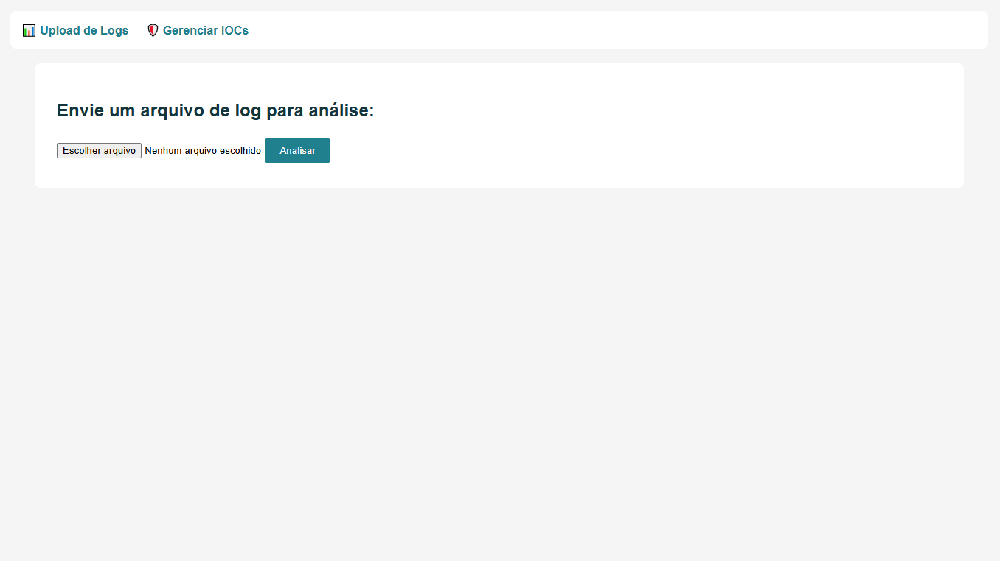
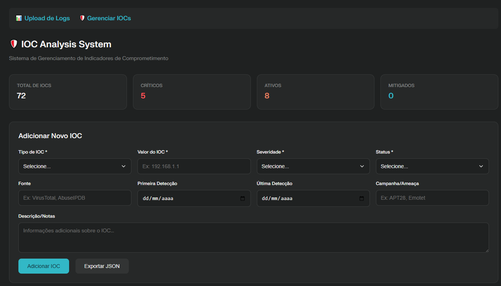
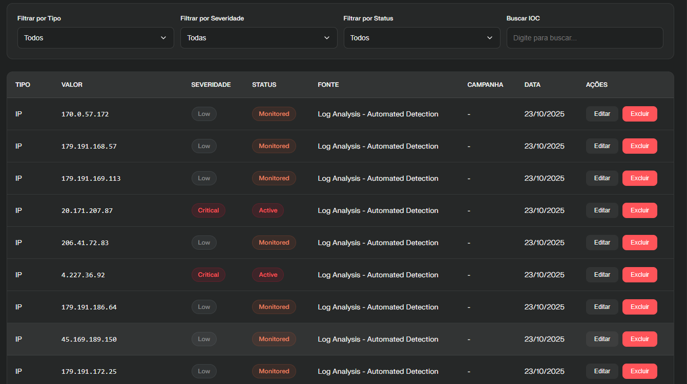

# IOC Analyzer - Blue Team

Sistema profissional para análise e gerenciamento de Indicadores de Comprometimento (IOCs) voltado a times de Segurança Cibernética e Blue Team.

## ✨ Funcionalidades
- Análise automática de logs com detecção de IPs, domínios, URLs e hashes maliciosos
- Verificação de reputação automática via AbuseIPDB (IPs) e VirusTotal (domínios, URLs, hashes)
- Classificação instantânea dos IOCs (Malicioso, Suspeito, Não Malicioso)
- CRUD completo e interface web moderna para gestão dos IOCs
- Exportação de IOCs em JSON
- Dados e modificações persistentes (não perde dados ao reiniciar)
- Suporte à exportação e revisão rápida dos indicadores

## 💻 Demonstração
### Tela de Upload e Análise de Logs


### Painel CRUD - Gerenciamento de IOCs


### Painel CRUD - Visualização Detalhada


## 📋 Requisitos
- Python 3.8+
- Flask
- Requests
- python-dotenv
- AbuseIPDB API Key
- VirusTotal API Key

## 🛠 Instalação
1. Clone o repositório:
git clone https://github.com/pablonoliveira/ioc_analyzer.git
cd ioc_analyzer

2. Crie e ative um ambiente virtual (opcional e recomendado):
python -m venv env

Ative no Windows:
.\env\Scripts\activate

Ou no Linux/Mac:
source env/bin/activate

3. Instale as dependências:
pip install -r requirements.txt

4. Configure as chaves de API:
- Crie um arquivo `.env` na raiz do projeto, usando `ioc/.env.example` como modelo:
  ```
  ABUSEIPDB_KEY=sua_chave_abuseipdb
  VIRUSTOTAL_API_KEY=sua_chave_virustotal
  ```
- **Nunca faça commit do seu .env!** Ele já está protegido no `.gitignore`.

## 🚀 Executando a aplicação
python webapp.py

- Upload de Logs: [http://127.0.0.1:5000/](http://127.0.0.1:5000/)
- Gerenciar IOCs: [http://127.0.0.1:5000/crud](http://127.0.0.1:5000/crud)

## 📁 Estrutura do Projeto

ioc_analyzer/
├── ioc/ # Integrações com AbuseIPDB/VirusTotal
├── parsers/ # Parser de logs para extração de IOCs
├── templates/ # Templates HTML (painel web CRUD)
├── utils/ # Utilidades e logger
├── data/ # Banco de dados dos IOCs (persistente)
├── docs/img/ # Imagens e prints de demonstração
├── requirements.txt # Dependências do projeto
├── webapp.py # Servidor Flask principal
└── README.md

## 🔒 Segurança

- Suas chaves de API ficam sempre no `.env` (excluído do controle de versão).
- As chaves devem ser obtidas em:
  - [AbuseIPDB](https://www.abuseipdb.com/)
  - [VirusTotal](https://www.virustotal.com/)

## 📝 Licença
GPL-3.0. Projeto aberto para fins educacionais e profissionais de Blue Team.

## 🤝 Contribuições
Contribuições são bem-vindas! Abra issues ou pull requests para sugerir melhorias.

## 👤 Autor

**Pablo Nunes de Oliveira**  | 
Analista de Segurança da Informação | Blue Team  

[LinkedIn](https://www.linkedin.com/in/pabloliveira/) |[Email](mailto:pabloliveir@gmail.com)
---

**Desenvolvido com foco em profissionais de Cibersegurança.**
